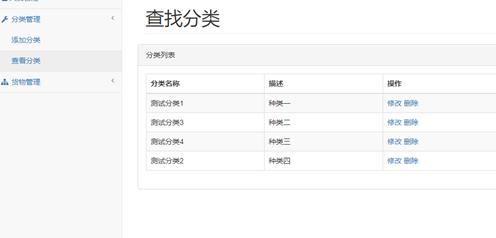
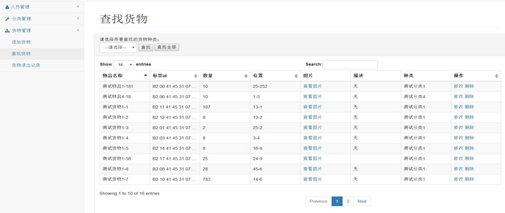
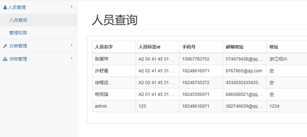
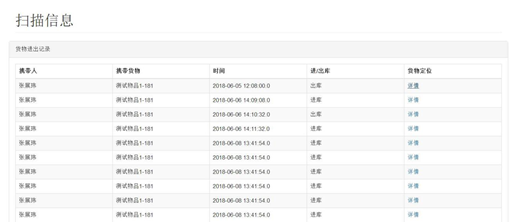
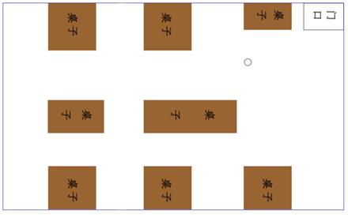

# warehouse-management-system

## 前言

本项目主要旨在打造一个基于基于无源超高频RFID的仓库系统，采用SSM框架实现的货物信息可视化后台开发，接口化的程序设计。

## 功能简介

1、系统功能包括：产品入出库登记，确认入出库信心，删除库内信息，借出信息登记，产品分类管理，报表生成，事件记录，数据警告

2、系统管理员功能：添加人员。删除人员，查询库内信息，系统配置，查看系统事件，用户管理，人员权限区分。

3、用户功能包括：查询库内信息，查询出库信息，查询入库信息，修改本用户密码

## 项目演示

### 仓库分类

### 仓库货物

### 人员管理

### 自动出入库盘点

### 路径追踪

